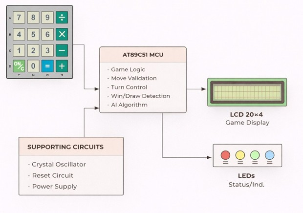
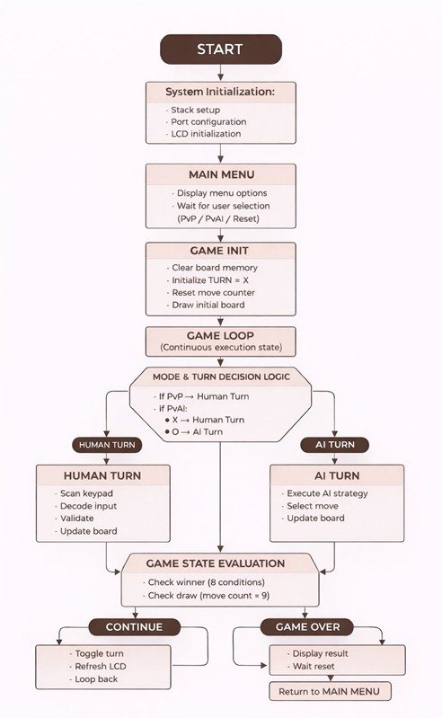
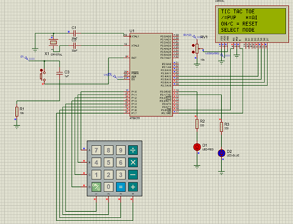
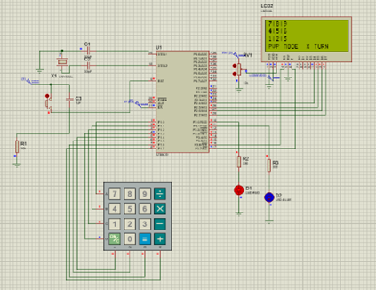

# RetroLogic-Handheld-Tic-Tac-Toe-Gaming-Device-AT89C51-Microcontroller
## Overview

RetroLogic is a standalone embedded Tic-Tac-Toe gaming device developed using the AT89C51 (8051) microcontroller and programmed entirely in 8051 Assembly Language.

The system supports both:
- Player vs Player (PvP)
- Player vs AI (PvAI)

The project focuses on low-level embedded system design, keypad interfacing, LCD control, rule-based AI implementation, and efficient hardware-software integration under strict memory and I/O constraints.

The entire system was designed, simulated, and validated in Proteus.

---

# Features

## Embedded Tic-Tac-Toe Gameplay
- Fully functional 3×3 Tic-Tac-Toe system
- Real-time board updates
- Turn switching between players
- Win and draw detection

## Dual Game Modes
- Player vs Player (PvP)
- Player vs AI (PvAI)

## Rule-Based AI
The AI system includes:
- Winning move detection
- Opponent blocking
- Fork creation
- Fork prevention
- Strategic corner and side selection

## LCD User Interface
- Game board visualization
- Turn indication
- Menu display
- Invalid move warnings
- Game result display

## Keypad Input System
- Board position selection
- Mode selection
- Reset and navigation controls

---

# Hardware Components

- AT89C51 Microcontroller
- 20x4 LCD Display
- 4x4 Matrix Keypad
- LEDs
- Crystal Oscillator
- Reset Circuit
- Capacitors and Resistors
- Breadboard / PCB

---

# Software & Tools Used

- 8051 Assembly Language
- Proteus
- Keil µVision
- Embedded Systems Design
- LCD Interfacing
- Keypad Scanning

---

# Block Diagram

The following image shows the overall system architecture including keypad input, AT89C51 microcontroller, LCD display, and supporting hardware units.

---

# System Flowchart

The flowchart below represents the complete software execution flow including menu selection, gameplay loop, AI logic, and game-over conditions.

---

# Reset Mode

This image shows the reset mode and initial startup interface of the system.

---

# PvP Mode

The following image demonstrates Player vs Player gameplay mode where:
- Player 1 = X
- Player 2 = O

---

# PvP Mode – Move O

This image shows gameplay progression after Player O performs a move.

.png)

---

# AI Algorithm

The PvAI mode uses a rule-based AI strategy with prioritized decision-making.

## AI Priority Sequence
1. Try to win
2. Block opponent
3. Create fork
4. Block opponent fork
5. Select strategic positions
6. Choose available corner/side

The AI was optimized for embedded implementation within limited 8051 memory and processing constraints.

---

# Engineering Constraints

## Low Cost
The system uses affordable and simple components suitable for educational embedded systems.

## Low Power
Designed for low-power operation suitable for battery-powered use.

## Limited Memory
Efficient RAM usage was implemented using minimal board-state variables.

## Limited I/O
Ports were optimized carefully:
- Port 1 → Keypad
- Port 2 → LCD Data
- Port 3 → LCD Control

---

# Learning Outcomes

This project provided practical experience in:
- Embedded system design
- 8051 Assembly programming
- LCD interfacing
- Keypad interfacing
- AI implementation in embedded systems
- Game logic development
- Hardware-software integration
- Proteus simulation and debugging
